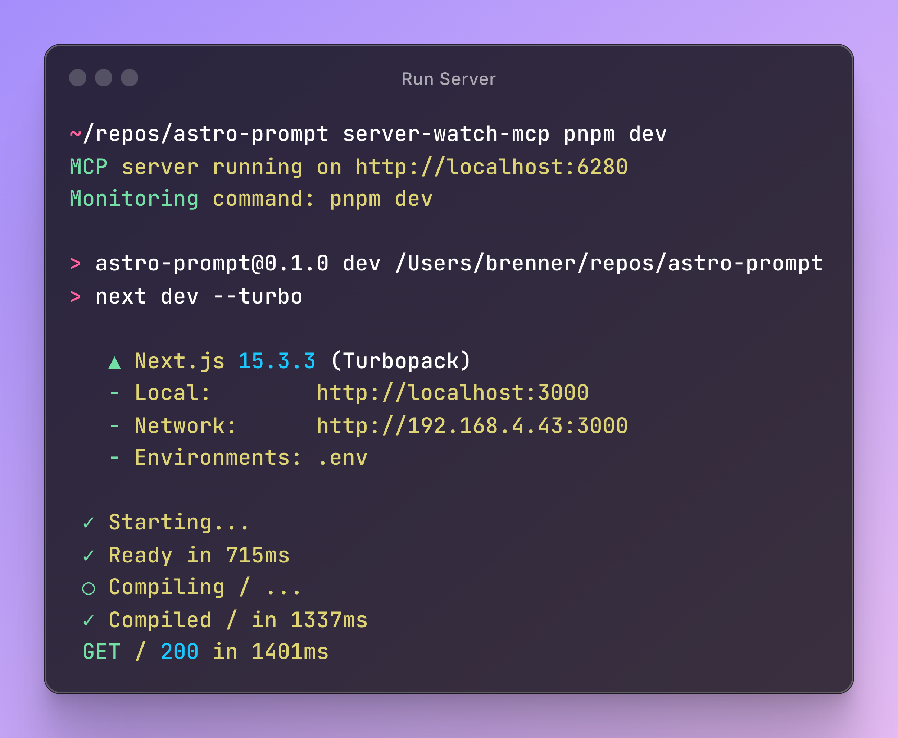
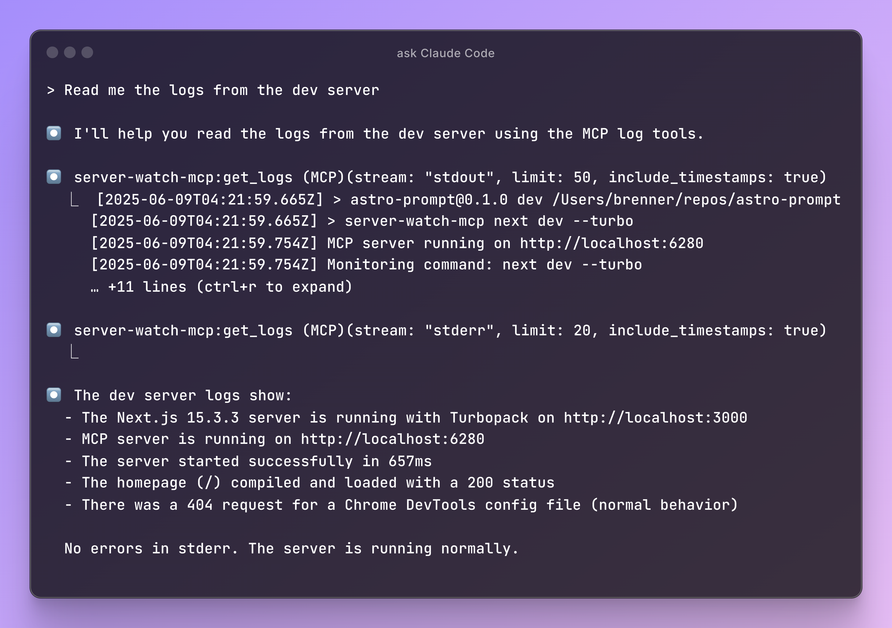

# server-watch-mcp

An MCP (Model Context Protocol) server that monitors and captures output from any running command. Perfect for development workflows where you need to access server logs, build output, or any process output.

## Features

- **HTTP-based MCP server** - Run as a standalone service that clients can connect to
- **Real-time log capture** - Captures stdout and stderr from any command
- **Circular buffer storage** - Maintains last 5000 log entries in memory
- **Two MCP tools**:
  - `get_logs` - Retrieve recent logs with optional filtering by stream type
  - `search_logs` - Search through logs with case-insensitive substring matching

## Installation

```bash
npm install -g server-watch-mcp
# or
pnpm add -g server-watch-mcp
# or in your project
pnpm add -D server-watch-mcp
```

## Usage

### 1. Start the MCP server with your command

```bash
# Monitor a development server
server-watch-mcp npm run dev

# Monitor a build process
server-watch-mcp npm run build:watch

# Monitor any command
server-watch-mcp python app.py
```
```jsonc
// In your package.json
{
    "scripts": {
      "dev": "server-watch-mcp next dev --turbo",
    }
}
```

The server will:
- Start an HTTP server on port 6280 (or `MCP_PORT` environment variable)
- Execute your command as a child process
- Capture all output from the command
- Continue running even if the child process exits

### 2. Configure Claude Code

In the project you're using Claude Code with, create or update your `.mcp.json` file:

```jsonc
{
	"mcpServers": {
		"server-watch-mcp": {
			"type": "sse", // Even though SSE is deprecated, Claude Code only supports SSE 
			"url": "http://localhost:6280/sse"
		}
	}
}
```

### 3. Use the tools in Claude

Once connected, you can use these tools:

- **Get recent logs**: "Show me the last 50 logs from stderr"
- **Search logs**: "Search for any errors in the logs"
- **Monitor output**: "What's happening with my dev server?"

## Environment Variables

- `MCP_PORT` - Override the default port (6280)
  ```bash
  MCP_PORT=6281 server-watch-mcp npm run dev
  ```

## How it works

1. The server uses the MCP Streamable HTTP transport, allowing multiple clients to connect
2. Your command runs as a child process with its output piped to the MCP server
3. All output is stored in a circular buffer (max 5000 entries)
4. The HTTP server persists even if your command exits, maintaining access to logs






## Development

```bash
# Install dependencies
pnpm install

# Build
pnpm run build

# Run tests
pnpm test

# Run in development
pnpm run dev
```

## License

ISC